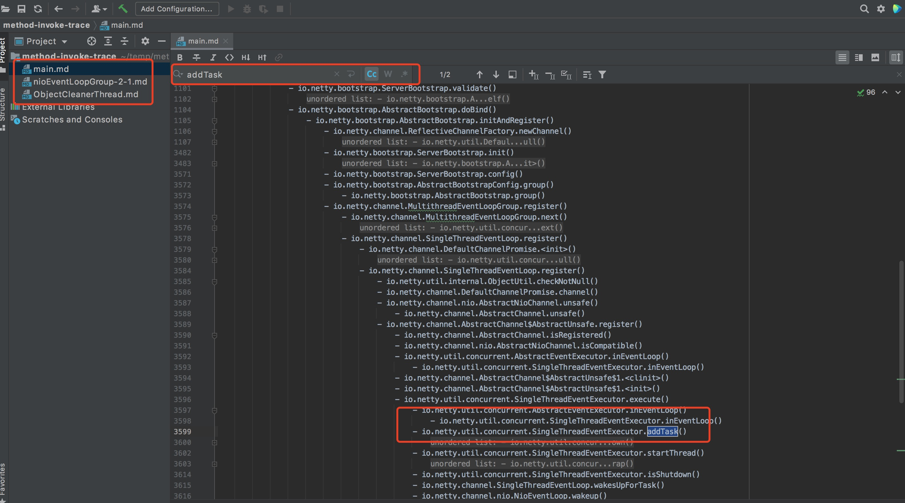

## method-invoke-trace
This is an agent tool which can dynamic trace java method invoke stack.
### how to use
- local environment
  - use ```mvn clean compile package``` command to generate target jar, for example: xxx/method-invoke-trace/target/method-invoke-trace-1.0-SNAPSHOT-jar-with-dependencies.jar
  - add jvm args ```-javaagent:xxx/method-invoke-trace/target/method-invoke-trace-1.0-SNAPSHOT-jar-with-dependencies.jar=startWith:xxx,outPut:xxx``` to trace.
- prod environment
  - use ```wget https://gitee.com/liufengking65/method-invoke-trace/blob/master/output/method-invoke-trace-1.0-SNAPSHOT-jar-with-dependencies.jar``` command to download the agent jar
  - add jvm args ```-javaagent:xxx/method-invoke-trace/target/method-invoke-trace-1.0-SNAPSHOT-jar-with-dependencies.jar=startWith:xxx,outPut:xxx``` to trace.
### trace result
- the trace result produce each thread stack with a markdown file, actually， you can view it by ide like this
  
### road map
- more args to control trace info
- add attach java progress 
- idea plugin
### License
The method-invoke-tracer is released under version 2.0 of the [Apache License](https://www.apache.org/licenses/LICENSE-2.0).