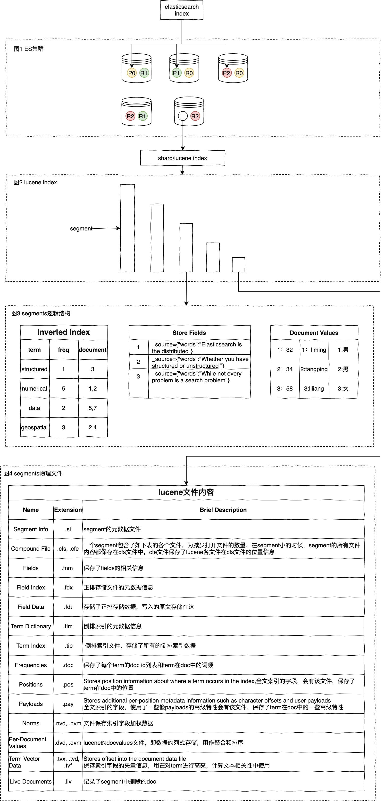

## es存储结构

- 图1 
    - ES集群由多个节点(Node)组成,elasticsearch index在es集群中是按分片(Shard)存储的，在创建索引时可以指定分片数量(制定后不能修改)和副本数量(可动态修改)。图1中的index分为3个分片，每个分片指定了2个副本。
- 图2 
    - ES集群中的一个分片本质上就是集群几点上的一个lucene index。Elasticsearch是建立在lucene之上的。lucene是一个全文搜索java库。一个lucene index在是由多个小segment组成的。如果segment过多，与Hbase LSM Tree类似，当segment过多时，lucene会合并小segments。
- 图3
    - segment内部由很多数据结构，最重要的3个结构有：Inverted Index，Stored Fields，Document Values。
        - Inverted Index : 一个有序的数据字典 Dictionary（包括单词 Term 和它出现的频率）。与单词 Term 对应的 Postings（即存在这个单词的文件）。
        - Stored Field : Stored Fields 是一个简单的键值对 key-value。默认情况下，ElasticSearch 会存储整个文件的 JSON source。如果指定一些字段store为true，这意味着这个field的数据将会被单独存储。如果对某个field做了索引，则可以查询。
        - Document Values。这种结构本质上就是一个列式的存储，它高度优化了具有相同类型的数据的存储结构，用来做排序、聚合、facet等。
- 图4
    - lucene数据元信息文件
    文件名为：segments_xxx,该文件为lucene数据文件的元信息文件，记录所有segment的元数据信息。该文件主要记录了目前有多少segment，每个segment有一些基本信息，更新这些信息定位到每个segment的元信息文件。lucene元信息文件还支持记录userData，Elasticsearch可以在此记录translog的一些相关信息。
    - segment的元信息文件
    文件后缀：.si,每个segment都有一个.si文件，记录了该segment的元信息。segment元信息文件中记录了segment的文档数量，segment对应的文件列表等信息。
    - fields信息文件
    文件后缀：.fnm, 该文件存储了fields的基本信息。fields信息中包括field的数量，field的类型，以及IndexOpetions，包括是否存储、是否索引，是否分词，是否需要列存等等。
    - 数据存储文件
    文件后缀：.fdx, .fdt, 索引文件为.fdx，数据文件为.fdt，数据存储文件功能为根据自动的文档id，得到文档的内容，搜索引擎的术语习惯称之为正排数据，即doc_id -> content，es的_source数据就存在这,索引文件记录了快速定位文档数据的索引信息，数据文件记录了所有文档id的具体内容。
    - 倒排索引文件
    索引后缀：.tip,.tim, 倒排索引也包含索引文件和数据文件，.tip为索引文件，.tim为数据文件，索引文件包含了每个字段的索引元信息，数据文件有具体的索引内容。5.5.0版本的倒排索引实现为FST tree，FST tree的最大优势就是内存空间占用非常低。
    - 倒排链文件
    文件后缀：.doc, .pos, .pay，.doc保存了每个term的doc id列表和term在doc中的词频，全文索引的字段，会有.pos文件，保存了term在doc中的位置，全文索引的字段，使用了一些像payloads的高级特性才会有.pay文件，保存了term在doc中的一些高级特性。
    - 列存文件（docvalues）
    Elasticsearch中的列式存储的名称，Elasticsearch除了存储原始存储、倒排索引，还存储了一份docvalues，用作分析和排序。

## es写入过程
## 参考
- [41张图解 ElasticSearch 原理](https://zhuanlan.zhihu.com/p/336889554)
- [ES stored fields作用](https://blog.csdn.net/m0_45406092/article/details/107631883)
- [详解ElasticSearch索引过程](https://www.bilibili.com/video/BV16k4y197vu)
- [Elasticsearch中数据是如何存储的](https://elasticsearch.cn/article/6178)

